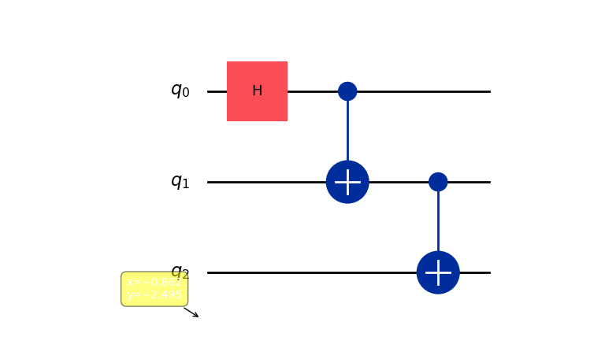

# GUI Simulator Examples

This guide provides step-by-step instructions for running quantum circuits using the **Circuit Builder** and **Quantum Finance** tabs in the GUI.

---

## 1. Bell State (Entanglement)

**Goal**: Create a pair of entangled qubits $|\Phi^+\rangle = \frac{|00\rangle + |11\rangle}{\sqrt{2}}$.

### Method A: The Fast Way (Presets)
1.  **Qubits Input**: Ignore (Preset overrides this).
2.  **Preset Dropdown**: Select **Bell State**.
3.  **Button**: Click **Load**.
4.  **Visualize**: Click **Visualize Circuit** to see the H and CX gates.
5.  **Run**: Click **Run Simulation**.

### Method B: Manual Build (Step-by-Step)
1.  **Reset**: Click the red **Reset App** button (Top Right).
2.  **Qubits**: Type `2` and click **Create**.
3.  **Add H Gate**:
    - Select **H** radio button.
    - **Idx 1**: Type `0`.
    - Click **Add Gate**.
4.  **Add CNOT Gate**:
    - Select **CX** radio button.
    - **Idx 1**: Type `0` (Control).
    - **Idx 2**: Type `1` (Target).
    - Click **Add Gate**.
5.  **Run**: Click **Run Simulation**.

**Expected Output**:
- **Histogram**: Two bars roughly equal height at `00` and `11`.
- **Probabilities**: ~0.50 for each.

---

## 2. GHZ State (Multipartite Entanglement)

**Goal**: Entangle three qubits $|\text{GHZ}\rangle = \frac{|000\rangle + |111\rangle}{\sqrt{2}}$.

### Method A: The Fast Way (Presets)
1.  **Preset Dropdown**: Select **GHZ State**.
2.  **Button**: Click **Load**.
3.  **Run**: Click **Run Simulation**.

### Method B: Manual Build (Step-by-Step)
1.  **Reset**: Click **Reset App**.
2.  **Qubits**: Type `3` and click **Create**.
3.  **Add H Gate**:
    - Select **H**.
    - **Idx 1**: `0`.
    - Click **Add Gate**.
4.  **Add CNOT (0 -> 1)**:
    - Select **CX**.
    - **Idx 1**: `0`.
    - **Idx 2**: `1`.
    - Click **Add Gate**.
5.  **Add CNOT (1 -> 2)**:
    - Select **CX**.
    - **Idx 1**: `1`.
    - **Idx 2**: `2`.
    - Click **Add Gate**.
6.  **Run**: Click **Run Simulation**.

**Expected Output**:
- **Histogram**: Two bars roughly equal height at `000` and `111`.
- **Note**: If you see other bars like `010` or `101`, double-check that you entered the correct indices for the CNOT gates!

#### Detailed Views:
**Circuit Diagram**:

**Measurement Results**:

---

## 3. Quantum Teleportation

**Goal**: Transfer state from Qubit 0 to Qubit 2.

### Steps:
1.  **Reset**: Click **Reset App**.
2.  **Preset Dropdown**: Select **Teleportation**.
3.  **Button**: Click **Load**.
4.  **Visualize**: Click **Visualize Circuit**.
    - You will see a complex circuit involving H, CX, and measurements.
5.  **Run**: Click **Run Simulation**.

---

## 4. Quantum Finance: AAPL Stock Analysis

**Goal**: Encode real Apple stock prices into a quantum circuit.

### Steps:
1.  **Tab**: Switch to **Quantum Finance** tab.
2.  **Stock Symbol**: Select **AAPL**.
3.  **Days**: Enter `10`.
4.  **Button**: Click **Load Data**.
    - *Wait for the "Loading..." bar to finish.*
5.  **Encoding**: Select **Angle Encoding**.
6.  **Button**: Click **Generate Circuit**.
7.  **Visualize**: Look at the "Quantum Circuit" panel at the bottom right.
    - You will see 10 qubits with RY gates.
    - Hover over the gates (optional) or the stock chart points to see values.

**Interpretation**:
- The rotation angles represent the normalized price of the stock for each day.
- Measuring this circuit gives a probability distribution reflecting the price trends.
